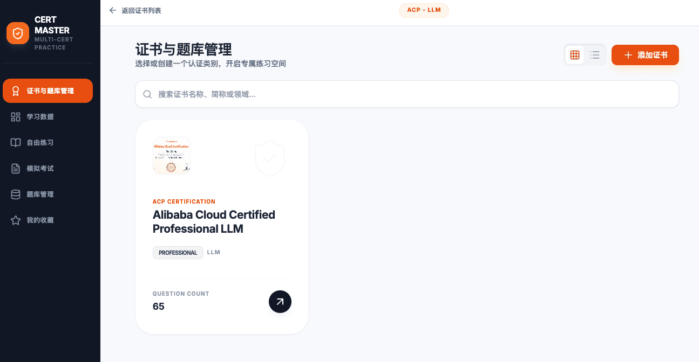
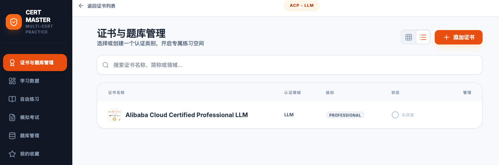
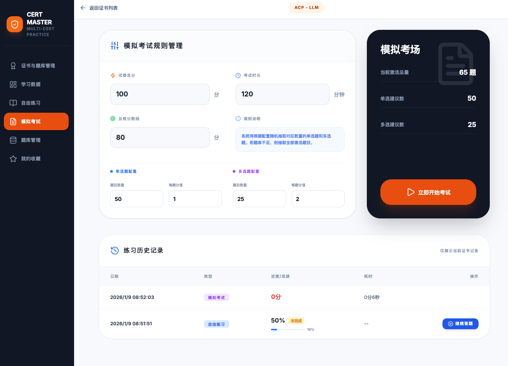

# CertMaster AI - 阿里云大模型 ACP 认证提分利器 🚀

[](https://ai.google.dev/)
[](https://reactjs.org/)
[](https://tailwindcss.com/)

CertMaster AI 是一款专为 **Alibaba Cloud Certified Professional (ACP) - LLM** 认证设计的全链路智能刷题系统。它不仅是一个题库，更是一个集成了 **Gemini 大模型自研命题**、**多维学习画像分析** 以及 **沉浸式模拟考场** 的智能学习助手。

---

## 📸 功能实测预览

### 1. 证书与多维度题库管理
系统支持多认证并行。您可以为不同的技术领域（如 LLM, Cloud, Security）创建独立的练习空间。支持卡片与列表双模切换，直观展示每个认证的题目总量与获取状态。

| 证书概览 (Grid View) | 证书列表 (List View) |
| :--- | :--- |
|  |  |

### 2. 智能化题库管理中心
支持 **Markdown/DOCX** 智能解析导入，自动识别题干、选项、答案及配图。
- **状态管理**：一键激活/禁用特定题库文件，灵活调整当前的练习范围。
- **数据导出**：支持将激活题库导出为标准 Word 文档，方便离线打印。


### 3. 大模型智能出题 (AI Powered)
基于 Gemini 2.5/3 Pro 模型，系统可根据您设置的**知识点权重**或**现有题目风格**进行仿真命题。
- **实时生成**：流式输出生成的题目，并支持一键加入题库。
- **高仿真度**：严格遵循 2:1 的单多选配比，难度对标官方真实认证。


### 4. 严谨的模拟考场与历史追踪
- **规则自定义**：灵活配置考试总分、及格线、各题型分值。
- **沉浸式体验**：全屏答题界面、实时倒计时提示、防误触提交机制。
- **历史回溯**：完整记录每次考试的得分、进度及耗时，支持未完成练习的断点续做。

| 考场规则设置 | 真实答题界面 |
| :--- | :--- |
|  |  |

### 5. 自由练习与错题本
- **自由练习**：支持答题/背题模式一键切换。
- **背题模式**：自动高亮正确选项并弹出 **AI 知识点深度解析**，适合快速扫盲。
- **错题重做**：系统自动捕获薄弱环节，循环练习直到完全掌握。

| 模式选择 | 背题详情与知识点解析 |
| :--- | :--- |
|  |  |

### 6. 全方位学习数据仪表盘
利用 Recharts 实现多维数据可视化，通过 **能力雷达图**、**提分趋势图** 和 **分项正确率柱状图**，为您的备考提供精准的量化指导。


---

## 🛠️ 技术底座

- **AI 核心**: Google Gemini API (@google/genai) - 负责智能命题与知识点关联。
- **前端框架**: React 19 + TypeScript - 极致的组件化开发与类型安全。
- **交互动效**: Tailwind CSS + Lucide Icons - 打造极简、丝滑、具有工业美感的 UI。
- **文档解析**: Mammoth.js - 高效处理 DOCX 到 HTML 的底层转换。
- **数据存储**: 本地浏览器 LocalStorage - 离线可用，隐私数据百分百归属于用户。

---

## 🚀 开发者快速上手

1. **准备环境**: 
   在您的运行环境中配置 `process.env.API_KEY`。

2. **本地运行**:
   ```bash
   npm install
   npm run dev
   ```

3. **截图说明**:
   项目演示截图已存储在 `/screenshots` 目录，对应关系如下：
   - `a.png / b.png`: 证书管理界面
   - `c.png`: 题库管理
   - `d.png`: AI 生成界面
   - `e.png / f.png`: 模考配置与答题
   - `g.png / h.png / i.png`: 练习模式与背题解析
   - `j.png`: 数据统计看板

---

## 🛡️ 开发者寄语
本系统旨在帮助开发者更轻松地通过阿里云认证，利用 AI 的力量将繁琐的“刷题”转变为“高效学习”。

*Powered by Gemini AI - 让认证不再是难事。*
